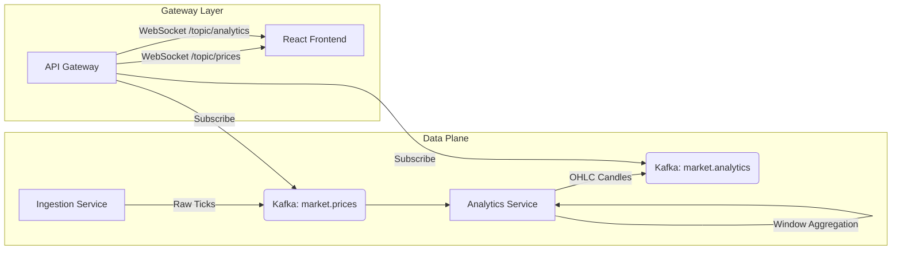

# CoinStream: Real-Time Financial Analytics Platform


CoinStream is a high-frequency trading simulation and analytics platform built with **Event-Driven Microservices**. It demonstrates end-to-end real-time data processing, from ingestion to visualization, capable of handling thousands of events per second with sub-second latency.

## 🏗️ Architecture



## 🚀 Key Features

*   **Real-Time Ingestion**: Simulates exchange connectivity (e.g., Binance) producing high-frequency tick data.
*   **Stream Processing**: Uses **Kafka Streams** to perform stateful windowed aggregation (1-minute OHLC candlesticks + Simple Moving Average).
*   **Event-Driven Gateway**: Spring Boot API Gateway consuming multiple Kafka topics and broadcasting via **STOMP WebSockets**.
*   **Interactive UI**: Modern React dashboard with **Recharts** visualization, featuring live candlestick rendering and dynamic indicators.
*   **Robustness**: Implements "manual deserialization" patterns to ensure schema evolution resilience between microservices.

## 🛠️ Technology Stack

*   **Backend**: Java 17, Spring Boot 3, Spring Cloud Stream
*   **Messaging**: Apache Kafka, Zookeeper
*   **Frontend**: React 19, Vite, TailwindCSS v4, Recharts, Lucide
*   **Infrastructure**: Docker, Docker Compose

## ⚡ Quick Start

The entire stack is containerized. You can launch the full environment with a single command.

### Prerequisites
*   Docker & Docker Compose

### Launch
```bash
docker-compose up --build
```

Access the application:
*   **Frontend Dashboard**: [http://localhost](http://localhost) (Port 80)
*   **Kafka UI**: [http://localhost:8090](http://localhost:8090)

## 🧪 Testing

The project includes unit and integration tests for the topology logic.

```bash
cd analytics-service
mvn test
```
